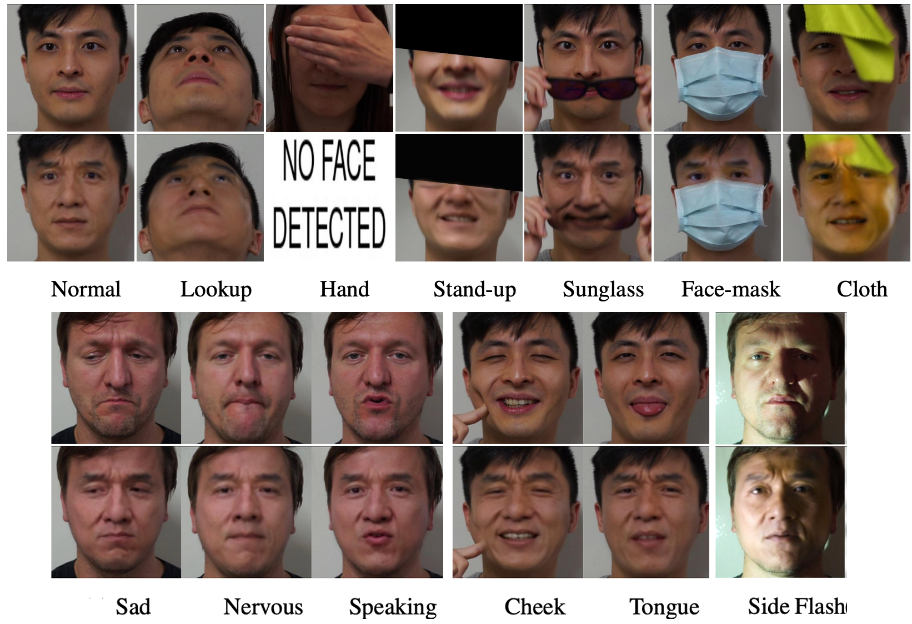

# GOTCHA
Official Repository for "GOTCHA: Real-Time Video Deepfake Detection via Challenge-Response".

**Accepted to 9th IEEE European Symposium on Security and Privacy 2024.**



## Dataset Information for GOTCHA

We release the dataset for non-commercial research. Submit requests <a href="https://forms.gle/6WPEGNWbYoEe6bte8" target="_blank">here</a>.

The dataset consists of three parts: Original Samples, Deepfakes, and the Fidelity Score Dataset.

The dataset is accessible via Box.com, which offers high availability worldwide and allows for access tracking.

### Dataset Statistics:

**Number of folder (or videos):**
- Original : 675 (673k frames with 3 frame sizes each)
- Fake (DFL) : 26,085 (5.0M frames)
- Fake (Adaptive - DFL) : 7,215 (1.3M frames)
- Fake (FSGAN) : 25,433 (4.6M frames)
- Fake (LIA) : 25,662 (5.0M frames)

**DFL quantized ready-to-use models** : 60

**Fidelity Score Dataset:**
- Fake : 49,603 videos (32 frames each, 1.35M frames total)
- Real : 816 videos (32 frames each, 22k frames total)

**Human evaluation dataset:** 200 videos


### Original Samples

While the paper focuses on 8 challenges, we collected 13 in total, which we share in full. The data is provided as frames extracted from raw HD videos recorded at 60 fps. We downsample the frames to approximately 10 fps for ease of use without any expected loss in generation fidelity. The images inside each zip file are face-only. We provide three convenient sizes: 224 x 224, 512 x 512, and 1024 x 1024 pixels.

Each zip file contains folders numbered according to the following challenges/tasks:

0. The camera moves around for about two minutes, capturing the face from different angles while the participant sits still.
1. The participant rotates their head from side to side, then looks up and down. Each side should be held for about 5 seconds, rotating as comfortably as possible, totaling around 25 seconds.
2. The participant covers their eyes with a hand, followed by covering the left half, the right half, and finally, the lower half of the face.
3. The participant puts on the provided sunglasses and then takes them off.
4. The participant wears the provided clear glasses, ensuring they reflect a lamp light shining. After setting up the reflection, recording starts. Finally, the participant removes the glasses.
5. The participant moves a green cloth in front of their face
6. The participant puts on a face mask and counts from 1 to 10 out loud. Then, they remove the facemask.
7. The participant presses a finger against a cheek.
8. The participant sticks out a (small) portion of their tongue.
9. The participant laughs for 10 seconds, then frowns, as if angry, for another 10 seconds.
10. The participant slowly stands up and then sits back down.
11. The participant counts from 1 to 50 with distinct breaks between each utterance.
12. The room light is dimmed, and a flashing light is kept on the face for 10 seconds.

**TODO: Verify each challenge index above corresponds to that challenge in the zips.**

Note: A few challenges are missing from a handful of participants. 

### Fakes

Using 47 participants, we create deepfakes between all 2,209 (47 x 47) combinations (including self deepfake), using three deepfake generators — DeepFaceLab, FSGANv2, and LIA. 

1. **DFL (DeepFaceLab)**: Notorious for generating hyper-realistic deepfakes, this pipeline serves as a baseline for in-the-wild deepfake videos. For our study, we trained *individual DFL deepfake generators for each participant* using their `no challenge' videos. These videos records the participants in a range of frontal angles while they sit naturally, aiming to mimic the kind of data readily accessible online for non-celebrity individuals. Training continued until convergence for approximately around 300,000 iterations. 
    
    **DFL (Adaptive Adversary)**: We utilized heavily trained celebrity deepfake generators provided by the community as an adaptive adversary. Such models are trained on upwards of 2M iterations.
    
    The DFL models trained by us and the ones provided by the community  are available under *dfm_models* folder, including the hyperparameters in states.dat file. The models can be loaded directly into Deepfacelive to generate deepfakes.
    
2. **FSGAN (Face Swapping Generative Adversarial Network)**: This corresponds to the second version of FSGAN. Similar to LIA, this model is also target-agnostic, hence we utilized a pre-trained model made available by the authors for our study. Access its release at https://github.com/YuvalNirkin/fsgan
3. **LIA (Latent Image Animator)**: This pipeline is a facial reenactment method outlined in. Given its target-agnostic nature—meaning it does not require specific target data during inference—we employed a pre-trained model for our experiments. Access its release at https://github.com/wyhsirius/LIA

As a rule of thumb, An imposter outer face and target is the inner face, in case of faceswaps. 

While Box offers quick zipping of multiple files, we have placed the files into zips (<10 GB each), for convenient access. Each zip under fakes (except Adaptive Adversary) is organized in path : “target/challenge/imposter/*.jpg”. For Adaptive Adversary, the order is opposite, i.e., “imposter/challenge/target/*.jpg”

### Fidelity Score Dataset (or a Snapshot of the full dataset)

The training subset contains the following subselections:

- Original and deepfake videos with four challenges, one from each category and ‘no challenge’.
- 32 frames per sample,
- 35 out of 47 target identities, and
- Deepfake videos created using only DFL.

The validation dataset consists of the remaining 12 out of 47 target identities, while test one includes the celebrity deepfakes. The dataset is the smallest snapshot of the full dataset. The code for loading the dataset and training a fidelity score function can be accessed at [https://github.com/mittalgovind/gotcha-deepfakes](https://github.com/mittalgovind/gotcha-deepfakes).

### Human evaluation

We release the instruments we used for human evaluation at [https://app.gorilla.sc/openmaterials/693684](https://app.gorilla.sc/openmaterials/693684) (with active preview).

The dataset of 200 videos as described in the paper can be found in *human_evaluation* folder. The naming convention is “generator_challenge_idx_target_imposter.mp4”. 


## Potential Use-cases for Original videos:

As the dataset consists of diverse actions, it can be utilized for novel tasks. Examples include, but not limited to:

- **Deepfake Generation:** Challenge #0 includes participants under with a stable posture while the camera moves around, can be used for creating 3D face models, such as NeRF, Gaussian Splatting.
1. **Deepfake Detection**: The dataset can be used to develop and benchmark algorithms for detecting deepfakes in real-time, especially under challenging conditions such as occlusions, lighting changes, and facial movements.
2. **Facial Recognition Under Adversarial Conditions**: The dataset can be utilized to train and test facial recognition systems that are robust to various adversarial conditions, such as face masks, sunglasses, and lighting variations.
3. **Facial Reenactment**: The dataset provides a diverse range of facial expressions and movements, which can be used to train and evaluate facial reenactment techniques for applications like virtual avatars or computer-generated imagery (CGI).
4. **Lip Synchronization**: The dataset includes challenges with participants speaking and counting, which can be used to develop and test algorithms for lip synchronization in deepfakes or other video synthesis tasks.
5. **Emotion Recognition**: The facial expressions in the dataset (e.g., laughter, anger) can be used to train and evaluate emotion recognition models, especially under challenging conditions.
6. **Facial Landmark Detection**: The dataset can be used to develop and benchmark facial landmark detection algorithms that are robust to occlusions and different facial poses.
7. **Face Anti-Spoofing**: The dataset can be utilized to develop and test face anti-spoofing techniques, which aim to prevent unauthorized access to systems using deepfakes or other forms of facial manipulation.
8. **Deepfake Forensics**: Researchers can use the dataset to develop forensic techniques for analyzing and detecting artifacts or inconsistencies in deepfake videos.
9. **Psychological Studies**: The human evaluation data can be used to conduct psychological studies on how people perceive and respond to deepfakes, helping to understand the social and ethical implications of this technology.
10. **Educational and Awareness Purposes**: The dataset can be used to educate the public about deepfakes, their potential misuse, and the importance of media literacy in the era of manipulated media.

If your research uses any part of the dataset, instruments and code, partially or in full, please cite:

```
@misc{mittal2023gotcha,
      title={Gotcha: Real-Time Video Deepfake Detection via Challenge-Response}, 
      author={Govind Mittal and Chinmay Hegde and Nasir Memon},
      year={2023},
      eprint={2210.06186},
      archivePrefix={arXiv},
      primaryClass={cs.CR}
}

```
